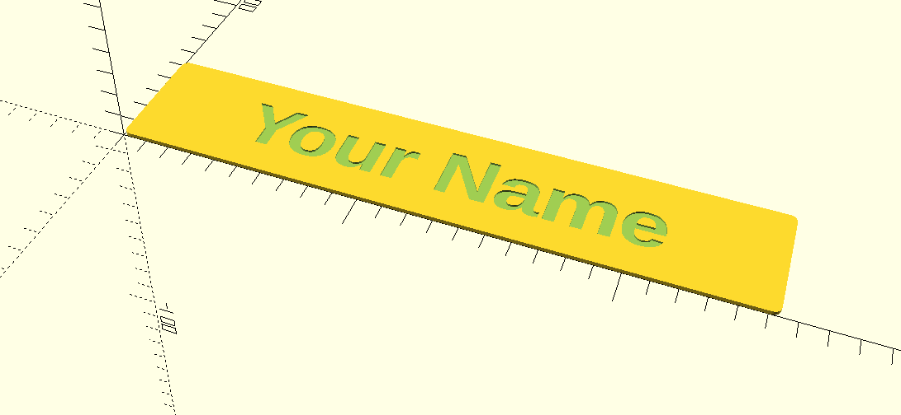

# nametags

An OpenSCAD script that generates customizable, parametric name placards suitable for office use.

## Instructions

The `nameplate.scad` file contains the main script. You can modify the parameters at the top of the file to customize the name placard according to your preferences.

To generate a name placard, follow these steps:

1. Install OpenSCAD from [https://www.openscad.org/](https://www.openscad.org/).
2. Open the [nameplate.scad](./nameplate.scad) file in OpenSCAD
3. Adjust the parameters at the top of the file to your desired specifications.
4. Render the model.
5. Export the model as an STL file for 3D printing.

This model is intended to be 3D printed using a color swap technique, allowing for a two-tone design. When slicing set the pause at over halfway through the hight of the print to change filament color.

*TIP:* If the print is longer than your print bed on the longest dimension, you can rotate the model to print diagonally allowingit to fit on the bed.

Suggested to start with a light color such as white and then switch to a darker color such as brown or black.

## Configuration (Default Values)

The plate width uses a standard size for office name placards, but can be adjusted to fit your needs.

**plate_thickness:** 1/16 inch
**plate_height:** 2 inches
**plate_width:** 10 inches

**name_text:** Your Name
**font_size:** 24

## Example

An example STL for "Your Name" with default parameters can is viewable as [example/yourname.stl](./example/yourname.stl).

